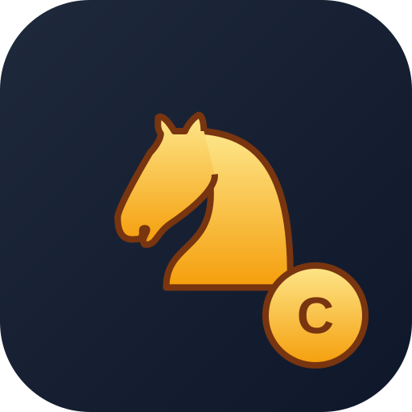

<div align="center">



# Checkmate Arena

**Chess with virtual coin stakes: play the computer, a friend, or (soon) players online.**

[](https://github.com/Duraidkw/checkmate-arena/actions/workflows/ci.yml)


### [▶ Play now](https://duraidkw.github.io/checkmate-arena/)

</div>

---

## ✨ Features

**Available now (Stage 1)**
- ♟️ **Complete chess rules:** castling, en passant, promotion with a piece picker, check, checkmate, stalemate, threefold repetition, the fifty-move rule, insufficient material
- 🤖 **Computer opponent** at 3 levels, running in a background Web Worker so the board never freezes
- 👥 **Pass & Play** on one device
- ⏱️ **Chess clocks:** 3+2, 5+0, 10+0, 15+10 or untimed, with increments and FIDE-style timeout rulings
- 🖱️ **Click-to-move and drag-and-drop**, legal-move hints, last-move and check highlights
- 📜 Move list, captured pieces and material balance, flip board, draw offers, resignation
- 📱 **Installable PWA:** works offline and is ready to package for Google Play
- ♿ Accessible: ARIA labels on every square, keyboard focus, reduced-motion support

**Roadmap**
| Stage | Scope | Status |
|---|---|---|
| 1 | Chess game, AI, clocks, PWA, full test suite | ✅ Done |
| 2 | Login (Google + email) and coin wallet: 1,000 free coins on signup, daily bonus, transaction history | 🔜 Next |
| 3 | Online matches: matchmaking by stake, real-time moves, **server-side move validation and coin settlement** | ⏳ |
| 4 | Google Play release: Trusted Web Activity package via PWABuilder, store listing, privacy policy | ⏳ |

> **Coins are virtual only.** They're earned in the game, can't be bought, and have no cash value. This keeps the app outside real-money gaming rules (India's Online Gaming Act 2025, Google Play's real-money gambling policy).

## 🏗️ Architecture

```
src/
├── chess/
│   ├── game.ts        # GameSession: rules (chess.js), clocks, results. The only API the UI uses
│   ├── clock.ts       # Deterministic chess clock (time is injected, so it's testable)
│   ├── engine.ts      # Fast 0x88 move generator for the AI, verified by perft
│   ├── ai.ts          # Alpha-beta search with quiescence, iterative deepening, time limits
│   └── ai.worker.ts   # Runs the AI off the main thread
├── ui/
│   ├── board.ts       # Board view: pointer events, drag & drop, promotion picker
│   ├── app.ts         # Screens, dialogs, game flow
│   └── sound.ts       # Synthesized sounds (no audio files)
└── main.ts
```

**Two engines, on purpose:** the rules players see are enforced by the battle-tested [chess.js](https://github.com/jhlywa/chess.js) library. The AI uses its own fast move generator, because searching thousands of positions per move needs speed. Both are checked against each other in the tests.

## 🧪 Quality

| Layer | Tool | Coverage |
|---|---|---|
| Static | TypeScript `strict` | Whole codebase |
| Unit | Vitest, **47 tests** | Every game-ending rule, clocks and increments, timeout rulings, AI finds mates and wins material |
| Engine accuracy | **Perft** | 19 checks on 6 standard positions (over 400,000 positions counted) match the [published counts](https://www.chessprogramming.org/Perft_Results) exactly. Also cross-checked against chess.js over hundreds of random positions |
| End-to-end | Playwright, **16 scenarios × 2 devices** | Desktop Chrome and Pixel 7, run against the production build |
| CI/CD | GitHub Actions | Every push runs type check → unit → build → E2E, then deploys to GitHub Pages |

## 🚀 Development

```bash
npm install
npm run dev          # http://localhost:5173
npm test             # unit tests
npx playwright install chromium
npm run test:e2e     # end-to-end tests (builds first)
npm run test:all     # everything, like CI
```

## 📄 Credits & License

- Code: MIT © Duraikandeeshwaran S
- Chess pieces: [Colin M.L. Burnett](https://en.wikipedia.org/wiki/User:Cburnett), [CC BY-SA 3.0](https://creativecommons.org/licenses/by-sa/3.0/)
- Rules library: [chess.js](https://github.com/jhlywa/chess.js) (BSD-2-Clause)
